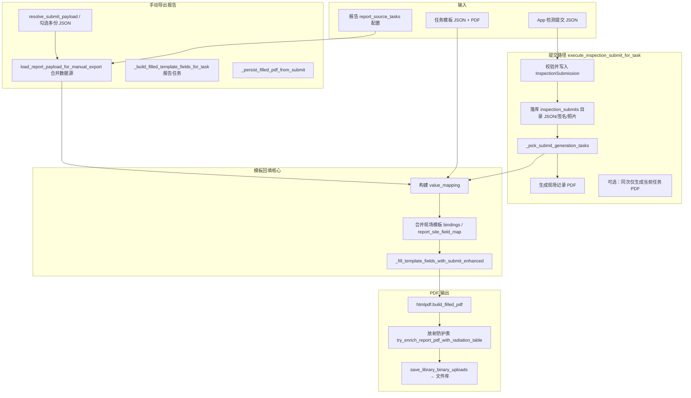

# 现场记录生成报告流程说明

本文档说明系统如何从 **检测提交数据**（及关联的 **现场记录任务模板**）生成 **现场记录 PDF** 与 **报告 PDF**。实现分散在 `apps/api/inspection_views.py`、`apps/api/inspection_pdf_service.py`、`apps/api/inspection_report_make.py`、`apps/core/htmlpdf_report_mapping_service.py`、`radiation_detection_report/` 等模块。

与 **多份报告 PDF 物理合并**（封面/目录/叠印）不同，见 [合并报告规则说明.md](合并报告规则说明.md)。

---

## 1. 术语与角色

| 概念 | 说明 |
|------|------|
| **项目** (`LibraryProject`) | 委托立项后的检测项目，如 `260001` |
| **案件** (`InspectionCase`) | 项目内一次检测会话；`case_no` 常与项目内 `taskNo` 一致 |
| **taskNo** | 项目内任务序号，如 `01`、`35`，或派工单号 `ASG-{assignment_id}` |
| **库任务** (`LibraryTask`) | 任务模板库中的一条任务；`output_target` 区分 **报告** / **现场记录** |
| **报告任务** | `output_target = report`；挂载报告 PDF/JSON 模板 |
| **现场记录任务** | `output_target = site_record`；挂载现场记录 PDF/JSON 模板 |
| **report_source_tasks** | 报告任务 M2M 指向其 **数据来源** 的现场记录任务（可多个） |
| **检测提交** | App/平板提交的 JSON（`reportInfo`、`hospitalInfo`、`equipmentInfo`、`testResult` 等） |
| **HTMLPDF 模板** | 带 `fields`（页码 + 坐标）的 JSON，配合空白 PDF 由 `htmlpdf` 填字导出 |

**典型链式关系**（任务模板库为准）：

```
报告任务 cbct-linac-status-report (#90)
    └── report_source_tasks → 现场记录 jxfs-js118-v20-cbct (#99)

报告任务 cbct-2 (#98)
    └── report_source_tasks → 现场记录 259072-01cbctct (#101)
```

项目 `library_tasks` 须包含链上 **报告 + 各现场记录**，委托立项「现场记录」列与 `taskNo` 序号才正确显示。

---

## 2. 总体流程



**要点**：

1. **结构化数据**以检测提交 JSON 为主；现场记录 **PDF** 是导出产物，一般不反向解析填报告（除非文件库「从现场记录 PDF 手动导出」走 `resolve_submit_payload_for_site_record_pdf_lf`）。
2. **报告回填**时会把 **报告任务** 关联的现场记录模板里的 `bindings`、`value_rules`、`report_site_field_map` 并入映射。
3. 同一次 **提交** 默认只给 **当前 taskNo 对应的那一个库任务** 生成 PDF（现场或报告），不会扫全项目所有模板。

---

## 3. 前置条件

### 3.1 任务模板库

- 报告任务下须有 **一个** 可用的 HTMLPDF JSON 模板（`fields` 含 `page` 与坐标）。
- 报告任务下须有 **一个** PDF 空白模板（或通过 JSON 内 `source_pdf.template_file_id` 指定）。
- 现场记录任务同样需 JSON + PDF（提交时若 taskNo 指向现场记录，则生成现场记录 PDF）。
- 报告任务的 `report_source_tasks` 应指向正确的现场记录任务（模板库维护界面或 `repair_task_template_library` 命令）。

### 3.2 项目挂载

- 设备加入项目后，应执行 **从委托设备同步项目任务**（`sync_project_library_tasks_from_equipments`），使 `project.library_tasks` 包含各设备报告链上的 **报告 + 现场记录**。
- `taskNo` 与库任务的对应：`project.library_tasks` 按 `code, id` 排序后的 **1-based 序号**（`01`、`02`…），或 `LibraryTaskAssignment` 的 `ASG-{id}`。

### 3.3 解析报告任务

`resolve_report_task_for_case(task_no, project)`（`inspection_pdf_service.py`）：

1. 若 `taskNo` 指向 **报告任务** → 直接用该任务。
2. 若指向 **现场记录任务** → `parent_report_task_for_site_task`：在项目内查找 `report_source_tasks` 包含该现场任务的报告。
3. 兜底：项目内 **唯一** 报告任务（多报告项目时不应依赖此兜底）。

---

## 4. 触发入口

### 4.1 检测提交（自动）

| 入口 | 路径 |
|------|------|
| API | `POST /api/v1|v2/inspections/projects/{project_id}/tasks/{task_no}/submit` |
| 兼容 | `POST /api/.../inspections/{task_no}/submit`、`POST /api/.../inspections/submit`（body 带 `taskNo`） |
| 核心函数 | `execute_inspection_submit_for_task`（`inspection_views.py`） |

**提交后顺序**：

1. 校验 `InspectionSubmitSerializer`，`update_or_create` `InspectionSubmission`。
2. 同步委托设备信息（`sync_commission_equipment_from_client_payload`）。
3. 处理仪器台账行、section 照片、二进制附件。
4. `_persist_submit_payload_file`：JSON 写入 `inspection_submits/{委托编号}/{时间戳}/`。
5. `_pick_submit_generation_tasks`：决定为哪些库任务生成 PDF。
6. 对每个任务：`_build_filled_template_fields_for_task` → `_persist_filled_pdf_from_submit`。

**`_pick_submit_generation_tasks` 规则**：

- 若调用方显式传入 `library_task`（现场或报告）→ **仅该任务**。
- 否则按 `taskNo` 解析到的那一个库任务 → **仅该任务**。
- 否则（旧兼容）→ 项目内各 `output_target` 取 **第一个** 现场记录 + **第一个** 报告（不推荐在多任务项目依赖此分支）。

因此：**提交现场记录 taskNo 时，同次通常只生成现场记录 PDF，不会自动生成报告 PDF**；报告需另调手动导出或再次以报告 taskNo 提交/导出。

### 4.2 手动导出报告

| 入口 | 说明 |
|------|------|
| API | `POST .../tasks/{task_no}/manual-export-report`（`InspectionTaskManualExportReportAPIView`） |
| 文件库 Web | `action=manual_export_report_from_site_record`，tab 为「检测提交」或「现场记录」 |

**API 流程**：

1. `_resolve_report_task_for_case` 得报告任务。
2. `resolve_submit_payload_for_report` 得当前 taskNo 的检测提交数据。
3. `load_report_payload_for_manual_export`：合并现场记录 JSON + 提交 JSON（提交优先）。
4. `_build_filled_template_fields_for_task(report_task, ...)`。
5. `_persist_filled_pdf_from_submit`（`output_category=report`）。

**文件库多选 JSON**：

- 勾选顺序经 `accumulate_inspection_payloads_ordered_merge` 合成一份数据源。
- `submit_merge_is_authoritative=True`：不再读文件库现场任务上额外挂载的 JSON，仅以勾选合并结果为准。
- 同案件同现场任务多份 JSON 会先 `dedupe_inspection_submit_selection_latest_per_site_record` 保留最新。

### 4.3 其他

- 项目工作台 **模拟提交**、**手动导出 PDF**（仅填数不经过完整 submit）亦调用同一套 `_build_filled_template_fields_for_task` / `_persist_filled_pdf_from_submit`。
- 前端运行时导出：`inspection_frontend_export_service.py`（预览填数，不一定落库报告 PDF）。

---

## 5. 数据源：现场记录 JSON 与检测提交的合并

### 5.1 手动导出合并逻辑

`load_report_payload_for_manual_export`：

```
merged = deep_merge(现场记录 JSON 合并结果, submit_payload)
```

- **同路径字段以检测提交为准**（后合并覆盖）。
- 无现场记录 JSON 时，仅使用 `submit_payload`。

### 5.2 读取现场记录 JSON

`_load_site_record_json_merged_only`（按 **报告任务的来源现场任务** 遍历）：

**候选文件**（同项目、关联案件）：

- 分类为 **检测提交** 的 `.json`；
- 或 M2M 挂在 **现场记录类库任务** 上的 `.json`。

**匹配到某一现场任务**（`_site_record_json_files_for_task`）：

1. 文件 M2M 包含该 `site_task`；
2. 或旧版文件名 `{taskNo}_submit_*.json`，`taskNo` 为该现场任务在项目内的序号/ASG 号。

每个来源现场任务下 **所有匹配 JSON** 会按读取顺序 **深度合并**（先读先打底，后读覆盖）。

**跨案件**：除当前 `case` 外，会纳入各 `report_source` 现场任务对应 **派工单案件**（`ASG-<assignment_id>`），避免报告 taskNo 与现场 taskNo 分属不同 case 时读不到数据。

**回退**：若按来源任务一条都匹配不到，则合并案件下 **全部** 检测提交 JSON（并提示应规范 taskNo）。

### 5.3 自动报告路径的回退

`_load_site_record_payload_for_report`（部分旧链路）：无现场 JSON 时依次回退：

1. 案件最新检测提交 JSON 文件；
2. 数据库 `InspectionSubmission.raw_payload`。

### 5.4 多份 JSON 合并策略（勾选导出）

`accumulate_inspection_payloads_ordered_merge` 对 **dynamicData** 特殊处理：**先勾选的键保留**，后勾只追加新键（避免 JS-001 / JS-117 等同名 `f1` 串位）。`testResult` 嵌套 dict 仍 **后勾覆盖先勾**。

---

## 6. 模板字段填充

### 6.1 选模板

`_build_filled_template_fields_for_task`：

1. 取库任务下 `category=template` 的 JSON 列表；
2. 解析 `htmlpdf_service.parse_template_json`；
3. 要求 `fields` 含布局坐标；**多个可用 JSON 时报错**（需只保留一个）；
4. 读取 `bindings`、`form_schema`（constants/enums/lookupTables）、`steps`；
5. 报告任务会 `_merged_bindings_for_report_task`：并入 **来源现场记录模板** 的 bindings。

### 6.2 value_mapping 与回填

`_fill_template_fields_with_submit`（默认 **enhanced**，可由环境变量 `INSPECTION_FILL_USE_LEGACY=1` 回滚 legacy）：

构建 `value_mapping`（语义键 → 字符串值）的主要来源（报告任务，顺序概念上「先现场模板、后提交、再报告模板覆盖」）：

| 步骤 | 内容 |
|------|------|
| 现场模板语义 | `_iter_site_record_parsed_templates_for_report` 顺序加载现场 JSON 模板，合并 dynamic 语义映射 |
| 提交 dynamicData | `_build_dynamic_data_semantic_mapping`、pdfFieldId 别名 |
| 报告 steps / fields | `_apply_template_field_sources_to_mapping`（submitPath、公式、判定） |
| 派生字段 | `_build_submit_derived_value_mapping`（日期拆分、台数、放射防护探测等） |
| **显式映射** | `apply_report_site_field_map_to_value_mapping`（bindings 内 `report_site_field_configs`） |
| 报告 fields 二次覆盖 | `overwrite=True` 再跑一遍 field sources |

**报告-现场字段映射**（`htmlpdf_report_mapping_service.py`）：

- 在模板编辑器配置：现场栏位 submitPath / 语义键 → 报告栏位 pdfFieldId。
- 多份勾选提交时，按 `templateId` / 模板文件名与现场任务对齐，从 `ordered_submit_payloads` 取对应 payload。

### 6.3 输出

将 `value_mapping` 写入模板 `fields` 的 `value`/`content`，得到 `filled_fields` 列表，供 PDF 渲染。

---

## 7. PDF 生成与落库

### 7.1 渲染

`_persist_filled_pdf_from_submit`：

1. `_normalize_fields_for_htmlpdf`：扁平化、排序；报告任务会跳过装饰性 field id、由叠印管理的 summary 字段等。
2. `htmlpdf_service.build_filled_pdf(normalized_fields, source_pdf)`。
3. **仅报告任务**：`try_enrich_report_pdf_with_radiation_table`（工作场所放射防护第五章表格嵌入，见 `radiation_detection_report/report_pdf_integrator.py`）。
4. `build_exported_inspection_pdf_original_name`：文件名一般为 **任务模板 name**（报告侧补 `_报告`），**不含**委托编号/taskNo。

### 7.2 文件库分类与关联

| 库任务 output | `LibraryFile.category` | 磁盘根目录（批次路径） |
|---------------|------------------------|-------------------------|
| `site_record` | `site_record` | `site_records/{委托编号}/{时间戳}/` |
| `report` | `report` | 报告存储规则 + `report_project` / `report_library_task` |

- `link_entity = inspection_case`，`link_object_id = case.pk`。
- `projects` M2M 包含当前项目。
- 生成后 `attach_files_to_tasks` 绑到对应库任务。

### 7.3 检测提交 JSON 路径

`inspection_submits/{委托编号}/{时间戳}/{文件名}`

文件名前缀常取现场记录任务 **name**（`submit_filename_prefix_for_task_no`），非 taskNo 字面量。

---

## 8. 放射防护表（可选后处理）

当报告模板 / 现场模板含放射防护章节且提交数据 scope 包含防护检测时：

- `try_build_report_data`（`report_data_builder.py`）从 bindings + 提交 JSON 构建点位表数据；
- 或从现场记录 PDF 提取（`extract_js009_chapter5` 等）；
- `RadiationTableBuilder` 生成竖版表格页，叠入报告 PDF。

详见 `radiation_detection_report/intro.md`。

---

## 9. taskNo 与文件库展示

文件库「检测项目 → 报告 → 现场记录」三级分组（`_nest_file_library_by_project_report_site`）：

- 报告 PDF 挂在 **报告任务** 层；
- 现场记录 PDF、检测提交 JSON、签名等挂在 **现场记录任务** 层；
- 分组键来自库任务 M2M 与 `parent_report_task_for_site_task`。

委托立项「现场记录」列：`site_submit_tasks_for_report_task` 要求现场任务已在 `project.library_tasks` 且能算出 `taskNo`。

---

## 10. 常见问题排查

| 现象 | 可能原因 |
|------|----------|
| 委托立项现场记录为「—」 | 现场任务未进 `project.library_tasks`；或报告 `report_source_tasks` 未配 |
| 手动导出报「未找到报告任务」 | taskNo 指向现场任务但项目内无报告与其 `report_source_tasks` 关联 |
| 报告空表 / 串位 | 多模板 `dynamicData` 混用；应用勾选合并或规范 taskNo；检查 `report_site_field_map` |
| 报告缺某现场段落 | 该现场任务 JSON 未匹配（taskNo/M2M 不对）；看 `missing_codes` / `mergeNote` |
| 提交后只有 JSON 无 PDF | 模板缺坐标 JSON 或多 PDF；`_pick_submit_generation_tasks` 未包含报告任务 |
| 提交后只有现场 PDF 无报告 | **设计如此**：同次提交默认只生成当前 task 对应 PDF；需手动导出报告 |
| 文件名与 taskNo 对不上 | 导出文件名用模板 **name**；taskNo 在 DB 关联与 `__task__` 后缀（旧版）中 |

**建议操作**：

1. 任务模板库核对 `report_source_tasks`。
2. 项目执行 `sync_project_library_tasks_from_equipments`。
3. 文件库查看该案件检测提交 JSON 的 `library_tasks` 与 `taskNo`。
4. API 手动导出响应中的 `mergeNote`、`sourceSiteRecordTasks`。

---

## 11. 关键代码索引

| 模块 | 函数 / 类 | 职责 |
|------|-----------|------|
| `inspection_views.py` | `execute_inspection_submit_for_task` | 提交入库 + 触发 PDF 生成 |
| `inspection_views.py` | `InspectionTaskManualExportReportAPIView` | API 手动导出报告 |
| `inspection_pdf_service.py` | `_pick_submit_generation_tasks` | 决定生成哪些库任务 PDF |
| `inspection_pdf_service.py` | `resolve_report_task_for_case` | taskNo → 报告任务 |
| `inspection_pdf_service.py` | `_resolve_library_task_for_task_no` | taskNo → 库任务 |
| `inspection_pdf_service.py` | `load_report_payload_for_manual_export` | 合并现场 JSON + 提交 |
| `inspection_pdf_service.py` | `_load_site_record_json_merged_only` | 按来源现场任务读 JSON |
| `inspection_report_make.py` | `_build_filled_template_fields_for_task` | 选模板、合并 bindings |
| `inspection_report_make.py` | `_fill_template_fields_with_submit` | value_mapping → filled_fields |
| `inspection_report_make.py` | `_persist_filled_pdf_from_submit` | HTMLPDF 渲染与落库 |
| `inspection_report_make.py` | `_iter_site_record_parsed_templates_for_report` | 现场模板解析顺序 |
| `htmlpdf_report_mapping_service.py` | `apply_report_site_field_map_to_value_mapping` | 报告-现场显式映射 |
| `hospital_info_service.py` | `sync_project_library_tasks_from_equipments` | 项目任务链同步 |
| `project_numbering.py` | `parent_report_task_for_site_task` | 现场 → 父报告 |
| `library_file_service.py` | `inspection_submit_relative_path` / `site_record_relative_path` | 落盘路径 |
| `radiation_detection_report/` | `try_enrich_report_pdf_with_radiation_table` | 放射防护表后处理 |
| `core/views.py` | `manual_export_report_from_site_record` | 文件库批量手动导出 |

---

## 12. 相关文档

- [WORKFLOW_COMMISSION_DISPATCH.md](WORKFLOW_COMMISSION_DISPATCH.md) — 立项、派工、App 检测链路  
- [任务模板检测仪器绑定与JSON模板.md](任务模板检测仪器绑定与JSON模板.md) — 模板 JSON 与仪器合并  
- [报告单项判定规则与逻辑.md](报告单项判定规则与逻辑.md) — 判定回填  
- [合并报告规则说明.md](合并报告规则说明.md) — 多报告 PDF 合并（另一流程）  
- [03-rest-api.md](03-rest-api.md) — REST 路径总览  
