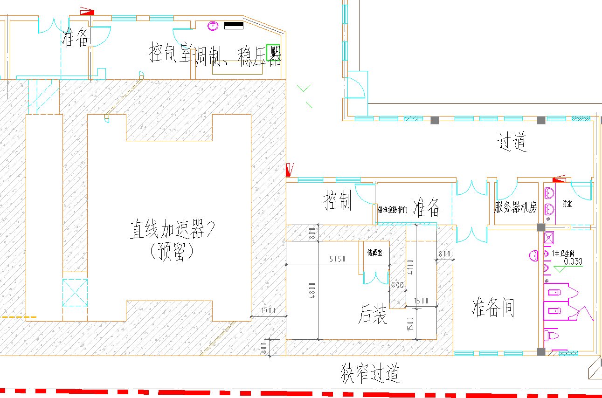
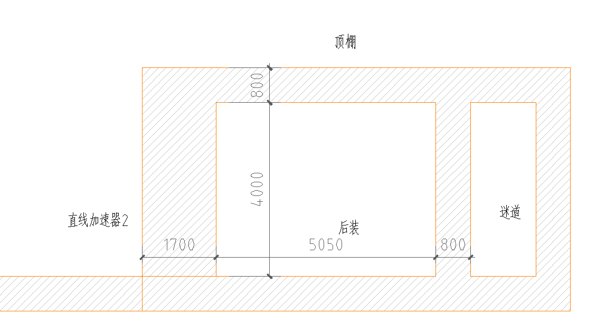
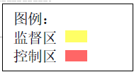
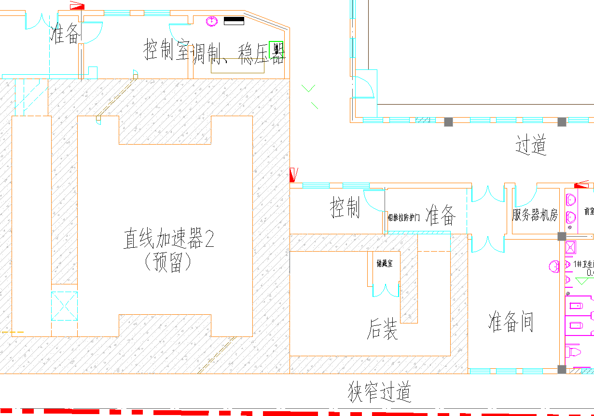
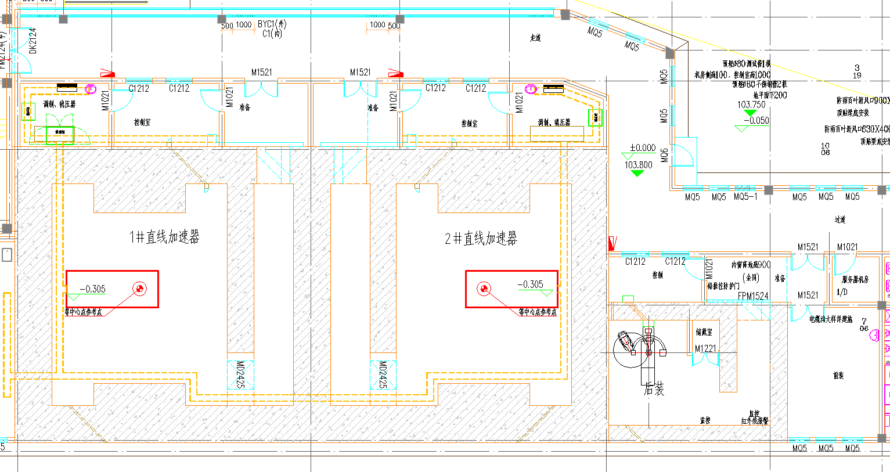
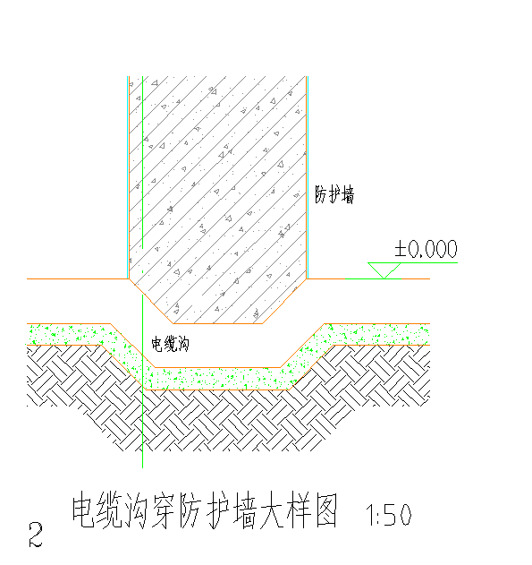
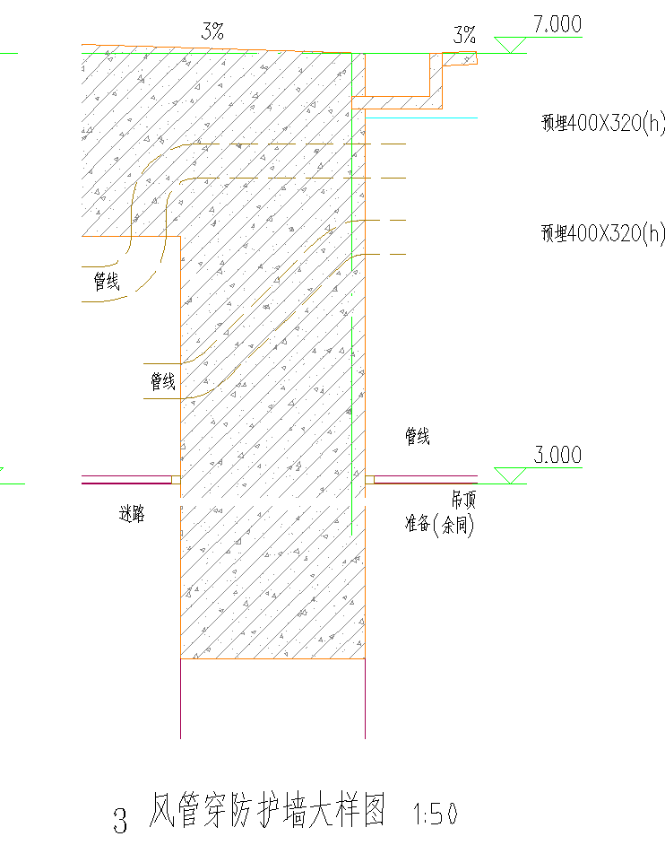

**建设项目放射性职业病危害****评价委托****单**

**委托编号：250420 **

**江西辐射剂量检测院有限公司：**

我单位根据《中华人民共和国职业病防治法》《放射诊疗管理规定》等法律法规要求，现委托贵单位对我单位以下建设项目进行放射性职业病危害评价工作。

<table>
<tr><td>评价类型</td><td colspan="6">☑放射性职业病危害预评价☑放射性职业病危害控制效果评价</td></tr>
<tr><td rowspan="2">单位名称</td><td colspan="4" rowspan="2">萍乡市人民医院</td><td>法定代表人</td><td>刘绍华</td></tr>
<tr><td>负 责 人</td><td>郑志刚</td></tr>
<tr><td>地    址</td><td colspan="4">江西省萍乡市开发区武功山中大道8号</td><td>邮    编</td><td>337000</td></tr>
<tr><td>联 系 人</td><td>陈佳龙</td><td>电话</td><td colspan="2">13707991201</td><td>传    真</td><td>/</td></tr>
<tr><td>项目名称</td><td colspan="4">萍乡市人民医院后装治疗机机房改建项目</td><td>建设地址</td><td>江西省萍乡市开发区武功山中大道8号</td></tr>
<tr><td>项目性质</td><td colspan="6">新建□  改建☑  扩建□  技术改造□  技术引进□</td></tr>
<tr><td>通讯地址</td><td colspan="6">江西省萍乡市开发区武功山中大道8号</td></tr>
<tr><td>项目 总投资</td><td colspan="3">1200万元</td><td colspan="2">放射卫生防护 投资</td><td>30万元</td></tr>
<tr><td>单位简介</td><td colspan="6">萍乡市人民医院（简称“建设单位”）始建于1928年，时称“普爱医院”，1960年正式更名为萍乡市人民医院；是集医疗、教学、科研、康复、保健为一体的大型三级甲等综合医院，是赣南医科大学非直属附属医院、中国医院百强院、国家临床药师培训基地、国家药物临床试验机构、国家住院医师规范化培训基地。2023年门诊人次108万人次，出院人次8.4万人次，手术台次3.4万例，业务辐射湘赣边区域数市县1300万人口，担负着萍乡地区60%急危重症病人的救治任务。医院现占地面积218109平方米，建筑总面积172827平方米，开放床位数1728张，编制床位1665张，拥有39个病区、44个临床专业、8个医技专业，拥有国家级临床重点专科建设项目1个、省级临床重点专科建设项目11个、省市共建先进学科15个、省市共建重点学科6个，市级重点学科26个，建立了2个院士工作站及13个名医工作室。</td></tr>
<tr><td>项目简介</td><td colspan="6">建设单位肿瘤大楼一楼后装机房内原山东新华生产的XHDR-18B型后装机于2017年开始启用至今已多年了，现设备各方面机能已无法满足放射治疗患者对于精准治疗的需求并已损坏，为了适应医疗保健事业和医院的发展需求，建设单位拟淘汰原后装治疗机，新购一台后装治疗机在原机房使用。根据《中华人民共和国职业病防治法》《放射诊疗管理规定》等法律法规要求，现委托江西辐射剂量检测院有限公司对该项目进行放射性职业病危害预评价及后续的控制效果评价。</td></tr>
<tr><td>管理目 标值</td><td colspan="6">工作人员：年有效剂量   5   mSv      公    众：年有效剂量   0.25   mSv</td></tr>
<tr><td>项目用途</td><td colspan="6">□X射线影像诊断 □介入放射学  ☑放射治疗  □核医学</td></tr>
<tr><td colspan="7">我单位承诺：在委托江西辐射剂量检测院有限公司承担放射卫生技术服务的活动中，本单位提供的相关资料真实、可靠，并加盖本单位公章！</td></tr>
</table>

委托单位:萍乡市人民医院 （盖章）

2025年6月10日

**辐射源项清单**

**放射治疗项目含密封源装置一览表**

<table>
<tr><td rowspan="2">序号</td><td rowspan="2">装置名称</td><td rowspan="2">生产 厂商</td><td rowspan="2">型号</td><td colspan="4">主要参数</td><td rowspan="2">拟安装场所</td><td rowspan="2">来源</td><td rowspan="2">源分类</td></tr>
<tr><td colspan="2">含源装置</td><td colspan="2">放射源</td></tr>
<tr><td rowspan="5">1</td><td rowspan="5">后装治疗机</td><td rowspan="5">待定</td><td rowspan="5">待定</td><td rowspan="5">最大装载活度</td><td rowspan="5">3.7×1011 Bq（10Ci）</td><td>源类型</td><td>192Ir</td><td rowspan="5">肿瘤大楼一楼后装治疗机房</td><td rowspan="5">拟新购</td><td rowspan="5">Ⅲ类</td></tr>
<tr><td>物理状态</td><td>固体</td></tr>
<tr><td>半衰期</td><td>74.0d</td></tr>
<tr><td>平均能量</td><td>0.37MeV（γ）</td></tr>
<tr><td>周围剂量当量率常数（裸源）</td><td>0.111μSv·m2/MBq·h</td></tr>
</table>

**建设射线装置和含密封源装置预期运行工作量**

<table>
<tr><td>序号</td><td>设备</td><td>预期诊疗患者人次</td><td>单人次平均出束时间</td><td>周工作天数</td><td>年工作周数</td><td>周工作量 （h）</td><td>年工作量 （h）</td><td>备注</td></tr>
<tr><td>1</td><td>后装治疗机</td><td>6人次/天</td><td>10min</td><td>5</td><td>50</td><td>5.0</td><td>250</td><td>设备质控时间约10分钟/次/周</td></tr>
<tr><td colspan="9">注：年最大工作量=预期日诊疗患者人次/台×单人次出束时间×周工作天数×年工作周数</td></tr>
</table>

**放射治疗项目机房屏蔽设计情况表**

<table>
<tr><td>机房名称</td><td colspan="2">屏蔽体</td><td>屏蔽设计材料及厚度</td></tr>
<tr><td rowspan="8">后装治疗机房</td><td>东墙</td><td>屏蔽体厚度</td><td>800mm混凝土</td></tr>
<tr><td rowspan="2">北墙</td><td>迷路内墙厚度</td><td>800mm混凝土</td></tr>
<tr><td>迷路外墙厚度</td><td>800mm混凝土</td></tr>
<tr><td>西墙</td><td>屏蔽体厚度</td><td>800mm混凝土</td></tr>
<tr><td>南墙</td><td>屏蔽体厚度</td><td>800mm混凝土</td></tr>
<tr><td>顶盖</td><td>屏蔽体厚度</td><td>800mm混凝土</td></tr>
<tr><td colspan="2">地坪</td><td>/（注：下方土层）</td></tr>
<tr><td colspan="2">防护门</td><td>屏蔽厚度：10.0mmPb 类型：电动推拉门</td></tr>
</table>

<table>
<tr><td>机房</td><td>位置</td><td>单位（mm）</td></tr>
<tr><td>后装治疗机</td><td>源离各墙的距离</td><td>≥1.0m</td></tr>
</table>

**建设项目放射工作人员****清单**

<table>
<tr><td>序号</td><td>姓名</td><td>工作岗位</td><td>执业范围/专业</td><td>学历</td><td>职称</td><td>备注</td></tr>
<tr><td>1</td><td>陈明伟</td><td>放射肿瘤医师</td><td>肿瘤内科</td><td>本科</td><td>中级</td><td>持有LA医师证</td></tr>
<tr><td>2</td><td>刘鲁根</td><td>放射治疗物理师</td><td>临床医学工程技术</td><td>本科</td><td>中级</td><td>持有LA物理师证</td></tr>
<tr><td>3</td><td>张红宇</td><td>放射治疗技师</td><td>放射技术</td><td>大专</td><td>中级</td><td>持有LA技师证</td></tr>
<tr><td>4</td><td>幸焕中</td><td>放射治疗技师</td><td>放射医学技术</td><td>本科</td><td>中级</td><td>持有LA技师证</td></tr>
<tr><td>5</td><td>欧阳公怒</td><td>维修工程师</td><td>临床医学工程技术</td><td>本科</td><td>中级</td><td>/</td></tr>
</table>

**本项目****放射工作人员配备****情况**

<table>
<tr><td>开展项目</td><td colspan="2">现有放射治疗工作人员</td><td>计划增加配置人数</td><td colspan="2">法规、标准要求</td><td>评价</td></tr>
<tr><td rowspan="5">放射治疗（后装治疗机）</td><td>中级放射肿瘤医师</td><td>1</td><td>/</td><td rowspan="5">《放射诊疗管理规定》第七条（一）</td><td>中级以上专业技术职务任职资格的放射肿瘤医师</td><td>符合</td></tr>
<tr><td colspan="3">设置专门的病理科，沿用原影像科专业技术人员</td><td>病理学、医学影像学专业技术人员</td><td>符合</td></tr>
<tr><td>中级医学物理人员</td><td>1</td><td>/</td><td>大学本科以上或中级以上专业技术职务任职资格的医学物理人员</td><td>符合</td></tr>
<tr><td>放射治疗技师</td><td>2</td><td>/</td><td rowspan="2">放射治疗技术和维修人员</td><td rowspan="2">符合</td></tr>
<tr><td>辅助维修人员</td><td>1</td><td>/</td></tr>
</table>

** ****本项目职业****人员健康管理一览表**

<table>
<tr><td rowspan="2">序号</td><td rowspan="2">姓名</td><td colspan="4">法规与防护知识培训时间</td><td>个人剂量监测情况</td><td colspan="4">职业健康体检</td></tr>
<tr><td>培训单位</td><td>最近一次 培训时间</td><td>培训类型</td><td>培训结果</td><td>监测单位</td><td>最近一次体检时间</td><td>体检单位</td><td>体检类型</td><td>最近一次 体检结果</td></tr>
<tr><td>1</td><td>陈明伟</td><td rowspan="5">江西省医学放射工作人员放射防护在线培训平台</td><td>2025.07</td><td>在岗</td><td>合格</td><td rowspan="5">江西辐射剂量检测院有限公司</td><td>2025.07.22</td><td rowspan="5">萍乡市人民医院</td><td>在岗期间/</td><td>可继续原放射工作</td></tr>
<tr><td>2</td><td>刘鲁根</td><td>2024.12</td><td>在岗</td><td>合格</td><td>2024.12.16</td><td>在岗期间</td><td>可继续原放射工作</td></tr>
<tr><td>3</td><td>张红宇</td><td>2024.12</td><td>在岗</td><td>合格</td><td>2025.07.22</td><td>在岗期间</td><td>可继续原放射工作</td></tr>
<tr><td>4</td><td>幸焕中</td><td>2025.06</td><td>在岗</td><td>合格</td><td>2025.07.22</td><td>上岗前</td><td>可从事放射工作</td></tr>
<tr><td>5</td><td>欧阳公怒</td><td>2025.07</td><td>在岗</td><td>合格</td><td>2024.08.06</td><td>上岗前</td><td>可从事放射工作</td></tr>
</table>

**后装治疗机机房****平面布局及尺寸图**

** ****后装治疗机机房****剖面图**

**本项目****放射分区****示意****图**

**放射治疗****机房防护安全措施拟安装位置图**

** ****后装治疗机****机房通风布局图**

<table>
<tr><td></td><td></td></tr>
<tr><td colspan="2">放射治疗机房电缆沟、风管穿墙示意图</td></tr>
</table>
